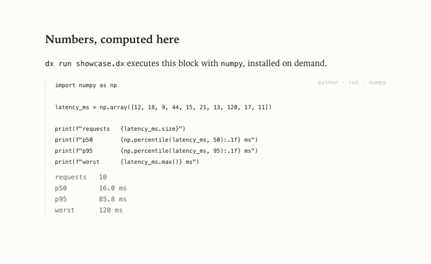
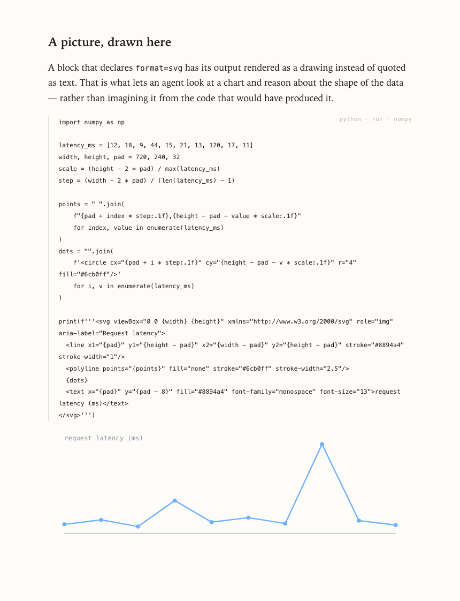

# dx — a notepad for code

A `.dx` file is a document: block-structured plain text that renders to a page, and that can
run the code inside it and keep what that code produced.

GitHub renders this README because it is Markdown. It will not render a `.dx` file — its file
viewer picks from a fixed, first-party list that a repository cannot add to. So the document
below is a **picture** of one, taken with `dx png`. It is
[`examples/showcase.dx`](examples/showcase.dx), and the numbers and the chart in it were
computed by its own code blocks and stored back into the file.

<picture>
  <source media="(prefers-color-scheme: dark)" srcset="docs/images/document-dark.png">
  
</picture>

Everything below explains how to get that.

---

## The document is text

A document is a sequence of typed blocks. Each one opens with `::type`, carries attributes,
and closes with `::end`:

```text
::heading level=2 id=numbers
Numbers, computed here
::end

::paragraph id=numbers-lead
`dx run showcase.dx` executes this block with `numpy`, installed on demand.
::end

::code id=stats lang=python run deps=numpy
import numpy as np

latency_ms = np.array([12, 18, 9, 44, 15, 21, 13, 120, 17, 11])

print(f"requests   {latency_ms.size}")
print(f"p50        {np.percentile(latency_ms, 50):.1f} ms")
print(f"p95        {np.percentile(latency_ms, 95):.1f} ms")
print(f"worst      {latency_ms.max()} ms")
::end

::output id=stats-output for=stats status=ok hash=b1323d9097e9ba05
requests   10
p50        16.0 ms
p95        85.8 ms
worst      120 ms
::end
```

That is the source. This is the page:

<picture>
  <source media="(prefers-color-scheme: dark)" srcset="docs/images/run-dark.png">
  
</picture>

The `::output` block is not something you write. `dx run` writes it, immediately after the
code that produced it, and replaces it on the next run rather than appending a second one.
Its `hash` fingerprints the code and its dependencies, so re-running a document executes only
what changed.

The format is canonical: one writer, one shape on disk, and a round trip that must not lose a
byte. [`docs/dx-format-contract.md`](docs/dx-format-contract.md) is the specification —
every block type, every attribute, and what the parser does with damaged input.

### Navigation is one block

Leave the body empty and it is this document's own contents — its headings, in order, nested
by level, with nothing to keep in step. That is the four-entry list under the title in the
first image:

```text
::nav id=contents

::end
```

Give it targets instead and it is a list of links, named by `label` unless you wrote a name
yourself:

```text
::nav id=side class=sidebar label="{n}. {name}"
- [Install first](setup.dx)
- api.dx#errors
- #results
::end
```

Resolution is a pure function of the document the block sits in — it never reads another file
— which is why the editor, the CLI, an agent, and the browser extension cannot show different
navigation.

---

## Running code

Mark a code block `run` and name what it needs:

```text
::code id=chart lang=python run deps="numpy matplotlib" timeout=120 format=svg
```

| Attribute | Meaning |
|-----------|---------|
| `run`     | This block is executable |
| `deps`    | Libraries to install before running |
| `reads`   | Sibling files the code reads (comma-separated) — their current text joins the run's fingerprint, so editing one re-runs the block |
| `timeout` | Seconds before the block is killed (default 60) |
| `format`  | `svg` or `html` — render the block's output as a drawing, not as quoted text |

Runners: **python** (via `uv` or a cached virtualenv), **node**, **typescript** (Deno),
**bash**, **rust** (Cargo), **go**, **ruby**. Each uses a toolchain already on your machine,
so a block behaves like the same code pasted into a terminal. Blocks run in the document's own
directory, so `open("data.csv")` finds the file next to the `.dx` — and they run inside a
sandbox that lets them read it and not replace it. A block writes to `$DX_SANDBOX`, reaches no
network, and cannot touch anything else you own; see
[What executes, and what does not](#what-executes-and-what-does-not).

`format=svg` is what makes a result something you can look at instead of read:

<picture>
  <source media="(prefers-color-scheme: dark)" srcset="docs/images/chart-dark.png">
  
</picture>

**Running a document is the only thing that executes it.** It happens through `dx run` or the
`dx_run` tool and nowhere else — not while reading, rendering, or screenshotting. `DX_NO_EXEC=1`
disables it entirely.

---

## Where the document lives

On disk, `notes.dx` is one line:

```text
~ dx1 c939d5becfb64b14193566ffed7ccf8217c90bf5c90e6ba2a5ce8bf87903c823
```

The content is in the workspace store, held as **content-addressed chunks** — one per block,
compressed, stored once however many documents or versions share it. Edit one paragraph in a
fifty-block document and only that paragraph is new bytes.

| Path | What it is | Committed? |
|------|------------|-----------|
| `notes.dx` | One line, carrying the digest of the content | yes |
| `.doc/repo.dxcp` | The repository's documents, deduplicated and compressed | **yes — this is the content** |
| `.doc/local.dxcp` | Git-ignored scratch documents | no |
| `.doc/index.db` | SQLite: the local authority, rebuildable from the packs | no |

Everything that reads a document resolves that pointer and gets the real thing — `dx text`,
`dx render`, the editor, every MCP tool an agent calls. Git does too: after `dx git-setup`,
`git diff`, `git show`, and `git log -p` render document diffs instead of digest changes.

```diff
 ::paragraph id=lead
-This document is not describing a program. It **is** one. The code blocks below …
+Rewritten opening paragraph.
 ::end
```

The digest is *in* the pointer on purpose. It makes the file change exactly when the content
changes, so git keeps tracking each document individually and nothing has to be kept in step
by hand.

Chunk payloads are byte-for-byte the canonical text the writer emits for one block, so
reassembling a document is concatenation — which is what makes the store lossless: it cannot
drop an attribute it had not heard of. Measured on this repository's six examples: 17,381
bytes of canonical source become a 5,982-byte pack, 34.4%, with every document recovered
byte-for-byte. Compression picks the smallest of its codecs per payload and stores the bytes
as they are when none of them wins, so the stored form is never larger than the input.

### What you actually see on github.com

Plainly: **the pointer line.** github.com cannot be extended server-side —
[`github/markup`](https://github.com/github/markup) picks from a fixed first-party list, a
GitHub App cannot touch a blob page, and `.gitattributes` does not reach the file viewer. So a
reader who has installed nothing sees `~ dx1 c939d5be…`, which is why this README carries
pictures rather than links to documents.

What resolves it is code in the reader's own browser — a browser extension, installed once,
by whatever route the browser allows. It is a separate thing from `dx` itself, and deliberately
so: a `dx` on a server, in a container, or in an agent's sandbox has no browser to give it to.

| Browser | How it arrives | Clicks |
|---|---|---|
| Firefox and relatives | `dx` writes a policy file; Firefox installs it at its next start | **none** |
| Safari | inside the `dx` application, where a Safari extension has to live | one, in Settings |
| Chrome, Edge, Brave, Vivaldi, Opera, Arc | the Chrome Web Store listing | one, per browser |

Those differences are not ours. On an unmanaged machine a Chromium browser will not accept an
extension from a local program at all — that route was closed deliberately, and it was measured
here rather than assumed ([`packaging/README.md`](packaging/README.md) records the test). Until
the listing is published, build one from a checkout with `dx browser --from editor/github` and
load it in developer mode; `dx browser` names the steps. With the extension loaded, however it
got there:

| Page | What you see |
|------|--------------|
| A `.dx` file | The rendered document |
| A blame view | The rendered document — a pointer's blame is one line about a digest |
| A pull request, commit, or compare | A **document diff**: which blocks changed, line by line |
| Anything else | Nothing. The extension is inert outside `.dx`. |

It declares `"permissions": []` and holds no host permission over github.com: the pack is
fetched from the page's own origin, so the request carries the session the reader already has —
no token, and no server in the middle. That is also what should let a private repository
resolve, though that specific case has not yet been checked in a signed-in browser. Every
document is verified against the digest in its pointer before it is shown; when something is
missing, the page says which file and what to run. [`docs/github.md`](docs/github.md) has the details, including which parts are covered
by tests and which are not.

---

## Install

One command, once, per device:

```bash
cd rust && cargo build --release -p doc-cli
./target/release/dx setup
```

`dx setup` is the whole install. It copies the binary somewhere on your `PATH`, registers its
MCP server with every AI assistant it finds — Claude, Codex, Cursor, VS Code, Windsurf, Gemini
— registers the rendering service to start with your session, installs `DX.app` so a
double-clicked `.dx` opens as a page, reports where this machine's browser extension is — the
app bundle's copy, or what `dx browser --from` wrote — and configures each browser it can:
Firefox by policy file, while every other browser is told the one step it reserves for you.
It needs no administrator and asks for no password.
`dx setup --uninstall` reverses everything it wrote outside its own directory.

On a Mac, `DX.app` is also what someone who does not open terminals installs: double-clicking a
`.dx` in Finder opens it in a window — the rendered page, drawn by the `dx` inside that same
application — and double-clicking the application itself runs the install above. One
application, because a viewer shipped apart from its engine is a second thing to keep in step.
`./packaging/build-app.sh` builds it, and [`packaging/README.md`](packaging/README.md) covers
what it contains and how it is published.

```bash
dx doctor      # what is installed, what is missing, and what is out of date
```

`dx doctor` reports the browser used for images, every code toolchain it can find, which
assistants are registered, whether the rendering service is registered *and* actually
answering, and how each browser on this machine stands.

First run, in a scratch directory:

```bash
mkdir /tmp/pad && cd /tmp/pad && git init -q .
cp /path/to/dx/examples/welcome.dx .
dx sync .            # adopt it: the file becomes a pointer, content goes to .doc/
dx git-setup .       # make git diff, git show, and git log -p render documents
cat welcome.dx       # a pointer
dx text welcome.dx   # the document
dx png  welcome.dx   # an image of the page
```

---

## Using it

```bash
dx text     notes.dx                 # the document as Markdown
dx outline  notes.dx                 # block ids, kinds, and previews
dx render   notes.dx                 # a self-contained HTML page
dx png      notes.dx                 # an image of the rendered page
dx png      notes.dx --pages         # one image per page, in reading order
dx png      notes.dx --block plan    # one block alone — a board at its natural size
dx play     notes.dx --script "wait 500ms; key Space; scroll 200"
                                     # drive the rendered page with real input and
                                     # keep one PNG frame per tick, annotated
dx open     notes.dx                 # open it in your browser
dx run      notes.dx                 # execute its code blocks
dx ls       .                        # every .dx document in a project
dx search   "deploy" .               # find documents by content
```

Add `--section <block-id>` to any reading command to get one part of a long document — a
heading id returns that whole section. `--theme light|dark|auto` picks the palette. `dx help`
lists everything.

Writing, when you want a targeted change from the command line rather than an editor:

```bash
dx new    guide.dx --title "Deployment guide"
dx source guide.dx --block intro     # the exact characters of one block
dx render guide.dx --block intro     # that block as the page draws it
dx set    guide.dx intro --text "New opening paragraph."
dx insert guide.dx --after intro     # a new paragraph, in the middle
dx remove guide.dx intro
dx check  guide.dx steps --item 1    # tick the second box of a checklist
dx append guide.dx --type code --lang python --run --text "print(1)"
dx fmt    guide.dx                   # rewrite in canonical form
```

`dx set` replaces one block by id and leaves every other byte alone. These are also exactly
what happens when a person clicks a block and types — one implementation, two ways in.
`dx render --block <id> --body=<text>` is the odd one out: it draws a block from characters
that were never saved, which is what lets the page keep rendering mid-sentence. It writes
nothing.

The store:

```bash
dx sync      .          # adopt, restore, and repair — run this in a new project
dx stats     .          # documents, block sharing, compaction
dx textconv  notes.dx   # print what a pointer stands for
dx git-setup .          # make git render .dx as documents
```

`dx sync` is the one command that repairs a workspace. It adopts any plain-text `.dx` file
something else wrote, rebuilds the index from `.doc/repo.dxcp` when it is missing — the
fresh-clone case, where all you have is pointers and the committed pack — and rewrites
pointers that drifted. It never discards content: a pointer it cannot resolve is reported,
not blanked.

Commit `.doc/repo.dxcp`. That is where your documents are; `dx git-setup` writes the
`.gitignore` lines that keep the rebuildable index out.

---

## `dx serve` — one engine per machine

```bash
dx serve                # http://127.0.0.1:7333
```

Every surface that shows a document has to resolve a pointer, and each one is a different kind
of program: a browser on github.com, an editor, a file preview. Shipping the engine into each
means a build per host, a cache per host — and in a browser extension, no durable cache at
all, because that context is shut down after seconds of idleness. So the engine runs once, in
a process that stays alive and keeps what it decodes, and every surface becomes a thin client
of it.

A client **names** a pack rather than sending one. The daemon answers `409 {"needPack": url}`
if it is not holding it, takes the bytes once, and answers every call after that from memory.
The browser extension prefers the daemon and falls back to its bundled engine when it is not
running, so the reader sees the document either way.

It reads no files, writes none, and runs nothing — `dx run` is not reachable from it. Ports
7333–7336, first free one wins.

---

## For AI agents

`dx setup` registers the MCP server (`dx mcp`) with every assistant it finds. Ten tools:

| Tool | What it does |
|------|--------------|
| `dx_read` | **The document as page images** — one per page, in order, each labelled with the blocks on it |
| `dx_play` | Drive the rendered page with scripted input — wait, key, click, scroll, hover — and get the frames back, each stamped with its moment and action |
| `dx_source` | The exact text, as Markdown, for quoting and editing |
| `dx_outline` | One row per block: id, kind, size, whether it is runnable |
| `dx_list` | Every document in a project, with title and block count |
| `dx_search` | Find documents by content and title |
| `dx_render` | The HTML page source |
| `dx_write` | Create a document, or replace one entirely |
| `dx_edit` | Replace the body of one block by id, leaving every other byte alone |
| `dx_run` | Execute the code blocks and report what each produced |

**An agent reads a document by looking at it.** A `.dx` file renders to a page, and what is on
that page — a table's alignment, the chart the code drew, what sits next to what — is in the
rendering and not in the source. So `dx_read` returns the pages, as pictures.

Pages break **between blocks**, never through a line, and a heading is never left stranded at
the foot of a page without the text it titles. Every page names the blocks on it, so an agent
that needs one part asks for it — `section` takes any block id from `dx_outline` — instead of
paging through the rest. On a machine with no browser the read falls back to text and says so.

**A board is always a page of its own**, photographed at its natural canvas size — every node
at exactly the box its line states — instead of as the miniature the page column fits it to.
And one block renders out alone: `dx_read` with `block` (or `dx png --block`) returns a single
image of that block — a board at natural size, a node's block as the page carries it — which
is how a board or one node is checked without paging through the document around it.

The same division from a shell:

```bash
dx png notes.dx --pages          # notes-1.png, notes-2.png, … and what is on each
dx png notes.dx --block plan     # notes-plan.png — just that block
```

**And it can watch the page react.** `dx_play` (and `dx play` from a shell) loads the same
render in a live headless browser, performs a small script of real input events —
`wait 500ms; key Space; click steps; scroll 200; hover intro` — and returns one frame per
tick, each stamped with when it was taken and which action it shows landing. `node` clips
every frame to one block's box, whose position an agent already knows from the block's own
stated numbers. Nothing in the document executes: play drives the same script-free page a
screenshot captures, so it is a read that can also see scrolling, hover, folds, and a board
being handled.

An assistant without MCP support needs no configuration at all: `dx` is a command, and
`dx help` explains itself.

---

## In VS Code

```bash
cd rust/doc-wasm && wasm-pack build --release --target nodejs --out-dir ../../editor/vscode/wasm
cd editor/vscode && npm install && npm run package
code --install-extension dx-documents-1.0.0.vsix
```

The extension renders through `doc-wasm`, which is `doc-core` compiled to WebAssembly — the
same renderer `dx render` calls, not a second implementation of it — so a document reads the
same in the editor, in a browser, and in an image. Rebuild the wasm after touching `doc-core`
or the editor silently keeps the old engine. The `.vsix` is platform-independent.

The rendered page is editable, exactly as it is in DX.app: click a block, type, press Return
for the next one. Edits here go through the text document, so undo, dirty state, and source
control behave as they do for text you typed by hand.

**DX: Open Changes** compares the document with the version in `HEAD` — as documents. The
editor's own "Open Changes" shows two pointer lines whose digests differ, because `git diff`
applies the driver `dx git-setup` installed and VS Code's git integration does not; this
resolves both sides through `dx textconv` first, so what you read is the prose that changed. A
side that cannot be resolved says so, in dx's own words.

---

## Writing on the page

A document opens as what it says, and it goes on saying it while you write. Click any block
and a field appears holding its own source — but the page does not stop being a page.

**The block keeps rendering.** What you type is `.dx` source, and source is not always what it
says: `**strong**`, a list's lines, a drawing's markup. So the block stays exactly where it was
on the sheet and redraws as the characters change — bullets stay bullets, a drawing stays a
drawing, and the source sits under it as a written note. Where a block renders to the
characters it is written in — plain prose, a code listing — there is nothing to show twice: the
field simply *is* the block, in the block's own type, and nothing on the page moves at all.

**Saving replaces content, never the page.** Nothing reloads, nothing flashes, and your scroll
position does not move — you are still looking at the place you were looking at.

| | |
|---|---|
| **Click** | edit that block |
| **Return** | save, and start the next paragraph |
| **⌘Return** | save and stop (inside code, lists, and markup, where Return types a newline) |
| **Escape** | discard what you typed |
| **Backspace** in an empty block | delete it, and land at the end of the block above |

Code blocks start folded behind one faint line naming the language — a document is read for
what it says, not how it was made — and what the code *produced* stays on the page. Click the
label to see the listing.

A checklist's boxes are boxes: click one to tick it off, and only that line of the file
changes. It ticks wherever the checklist is — down the page, or inside a node on a board.

### The board

A `::board` is a node editor drawn on the sheet: its nodes are the document's own blocks,
arranged on a canvas instead of down the page. `examples/example_site_plan.dx` is a whole
website designed and shipped on one — brief, audience, a palette tile, the shipped files as
listings, what has to be true before it ships, and the site itself standing on the board
twice: the same `site/index.html`, framed live at desk width and at phone width (`::view
src=site/index.html width=390`). The screens are not mockups — they are the coded page
actually rendering, so editing `site/site.css` changes them on the next render.

It opens **fitted**: whatever is on it, scaled on both axes, all of it in view. Drag a node
by the label bar above it. Drag a connection out of **any edge of any node onto any edge of
another** — a whole edge is the connection point, and the line stays on the two edges you
drew it between, fanning out along a side when several meet there. Reshape a node from its
bottom-right corner, or double-click that corner to fit it to what is in it. Drop a node on
top of another and the board makes room: the one you placed stays where you put it, and what
it landed on moves down. Click inside a node and you are writing in that block, the same as
anywhere else on the page.

An agent does all of it through one command:

```bash
dx board plan.dx plan --place brief --x 0 --y 0 --w 360 --h 170   # move and reshape
dx board plan.dx plan --place measure --w page --h fit            # rules, not numbers
dx board plan.dx plan --arrange "brief,0,0,360,170 sitemap,0,210,360,220"
dx board plan.dx plan --link brief --to sitemap --from-side b --to-side t
```

A node's box — `x y w h` on its line — is the whole of where it is and how big it is, so a
board is laid out identically by a browser, a PNG, and a terminal, and neither a drag nor a
`dx board` call can leave one node covering another. A dimension may also be a rule instead
of a number: `w=page` takes the page's own column, and `h=fit` sizes the node to the block
it shows — and keeps fitting as that block is rewritten, because the line keeps the word,
not the number it resolved to.

### References — write it once, review it current

A document can name what it does not carry, so nothing is pasted twice and nothing shown
is stale. `::code id=listing src=src/lib.rs lang=rust` renders the file's **current**
text as its listing — and with `run`, executes it, so the recorded output goes stale
exactly when the file changes: the documentation is the test surface.
`::view id=screen src=site/index.html width=390` shows the **page the file renders to**,
framed live at the stated viewport with its own stylesheet inlined — the reference the
other way up: the listing is what the code says, the view is what it does. The frame is a
sandbox allowed nothing, so a view is only ever shown; nothing in it runs. A board node
may name a block of a **sibling document** — `- plan.dx#step-one x=20 y=20` — and every
board naming it shows the block as it is now. The saved document keeps the reference,
never a copy; a reference that resolves to nothing renders as a sentence naming the path,
never as silence; and a path can only walk downward from the document's own folder.
`docs/dx-format-contract.md` § References has the rules.

The same operations are what an agent uses (`dx source`, `dx set`, `dx insert`, `dx remove`,
`dx check`, `dx board`, and `dx render --block` for the live draw), and both go through one
implementation in `doc-core`, so a page edited by a person and a document edited by an agent
cannot come out shaped differently.

---

## What executes, and what does not

- **Reading never executes, and never writes.** Parsing, rendering, screenshotting, and
  resolving a pointer are free of side effects; resolving does not even create the index. Only
  `dx run` and the `dx_run` tool execute code, and `DX_NO_EXEC=1` turns that off.
- **Code that does run is confined by the kernel.** A `.dx` is something you were handed, so
  its code does not get your permissions. Every block runs inside a sandbox — Seatbelt on
  macOS, bubblewrap on Linux — that lets it **read** (so `open("data.csv")` still finds the
  file next to the document), lets it **write only its own scratch directory**, and gives it
  **no network at all**. Reading your files is useful; reading them and being able to send
  them somewhere is not, which is why the network denial is what makes the read permission
  safe to grant. Credential stores (`~/.ssh`, `~/.aws`, `~/.gnupg`, the keychain, browser
  profiles) are not readable either, and the block gets a clean environment rather than the
  shell you started `dx` from.

  Installing declared `deps` is the one phase with a network, because `npm` and `uv` cannot
  work without one — and it is confined in every other way, since an install runs the
  package's own scripts. A block that wants to keep a file writes it to `$DX_SANDBOX`.

  `dx doctor` names the boundary in force. If a machine has none, `dx run` refuses rather than
  running the code anyway; `DX_UNCONFINED=1` overrides that and stamps a line saying so into
  the output it produces. The claim is tested by attacking it — see
  [`attacks.rs`](rust/doc-run/tests/attacks.rs), which is a file of real payloads (write beside
  the document, append to `~/.zshrc`, install a login item, resolve DNS, open a socket, upload
  a file, escape by symlink, outlive the timeout) each asserted to fail.
- **Author markup is sanitized against an allow-list.** `::html` and `::svg` blocks keep
  working, but an element, attribute, or URL scheme that is not named in
  [`render/escape.rs`](rust/doc-core/src/render/escape.rs) is dropped — after decoding the
  entities and control characters a browser would decode before acting on the value. This
  replaced a deny-list that several real payloads got through; each of them is now a test.
  The reason it matters is that a document rendered by the browser extension is a stranger's
  markup inside github.com's origin.
- **`dx serve` answers loopback only.** Every request must carry a loopback `Host` — the check
  that stops DNS rebinding, which no cross-origin rule can — and an `Origin`, if present, must
  be the extension. It holds packs a browser handed it, nothing else; it opens no file and
  starts no process.
- **The extension holds no host permission over github.com.** `manifest.json` declares
  `"permissions": []` — pinned by a test — and one host permission, `http://127.0.0.1/*`, for
  the daemon. Its content script runs on github.com pages and fetches from that page's own
  origin, which is what makes private repositories resolve with no token.

---

## How it fits together

```text
   notes.dx            .doc/index.db  +  .doc/repo.dxcp
  (one-line   ────────►  chunks, manifests, packs  ◄──── the content
   pointer)                        │
                                   │ resolve (always the true document)
                                   ▼
                            ┌─────────────┐
                            │  doc-core   │──► HTML page ──► browser, editor, screenshot
                            │  parse +    │──► page images ──► agents reading it
                            │  render     │──► Markdown  ──► git diffs, exact text
                            └──────┬──────┘──► outline   ──► navigation
                                   │ compiled twice
                      ┌────────────┴────────────┐
                native binary              WebAssembly
             (dx CLI, dx mcp, dx serve)  (VS Code + GitHub extensions)
```

One engine, compiled for both hosts. That is what guarantees a document cannot look like one
thing in your editor and another to an agent.

| Crate | Responsibility |
|-------|----------------|
| `rust/doc-core` | The format and its views: parse, canonical write, HTML, Markdown, outline, sections, navigation, and content-addressed chunks. No OS dependencies; compiles to wasm |
| `rust/doc-store` | The SQLite chunk store and the resolver: manifests, packs, git routing, pointers |
| `rust/doc-run` | Executing code blocks: language plans, dependency installation, sandboxes, timeouts |
| `rust/doc-shot` | Rendering a document to PNG through an installed Chromium, and dividing it into pages |
| `rust/doc-cli` | The `dx` binary: commands, the MCP server, `dx serve`, and the installer |
| `rust/doc-wasm` | `doc-core` for JavaScript hosts |
| `editor/vscode` | The VS Code extension |
| `editor/github` | The browser extension that renders documents on github.com |

Each saved version keeps a manifest — the ordered list of chunks it is made of — so an old
revision stays readable for almost nothing, which is what lets `git log -p` render history.

---

## Development

```bash
cd rust
cargo test                                  # the full suite
cargo clippy --all-targets -- -D warnings
cargo fmt --check
```

The two JavaScript surfaces have their own suites, and neither needs a browser:

```bash
./editor/github/test/fixture.sh              # a real pack, written by a real `dx sync`
node --test "editor/github/test/*.test.mjs"  # 34 tests
node --test "editor/vscode/test/*.test.mjs"  # 11 tests
```

Every public item is documented, there is no `unsafe`, and library code does not panic.
`examples/` and `documents/` are kept as plain text so they are readable here on GitHub — so
do **not** run `dx sync` at the repository root; it would convert them into pointers. Try the
store in a scratch directory instead.

There was once a TypeScript implementation of all of this. It is gone: its round-trip quirks
were silently destroying content — checklist items erased on save, nested list items dropped,
unnamed paragraphs destroyed on re-read — and each of those is fixed in the Rust format, with
the test that catches it.
