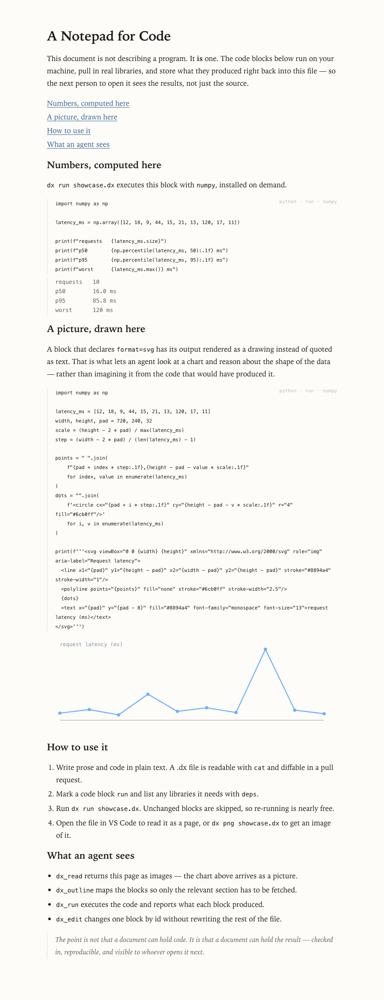

# dx — a notepad for code

A `.dx` file is a document: block-structured plain text that renders to a page, and that can
run the code inside it and keep what that code produced.

GitHub renders this README because it is Markdown. It will not render a `.dx` file — its file
viewer picks from a fixed, first-party list that a repository cannot add to. So the document
below is a **picture** of one, taken with `dx png`. It is
[`examples/showcase.dx`](examples/showcase.dx), and the numbers and the chart in it were
computed by its own code blocks and stored back into the file.

<picture>
  <source media="(prefers-color-scheme: dark)" srcset="docs/images/document-dark.png">
  
</picture>

## What a document is

A document is a sequence of typed blocks — prose, headings, lists, tables, drawings, boards,
and code. Each block opens with `::type`, carries attributes, and closes with `::end`:

```text
::code id=stats lang=python run deps=numpy
import numpy as np
latency_ms = np.array([12, 18, 9, 44, 15, 21, 13, 120, 17, 11])
print(f"p95  {np.percentile(latency_ms, 95):.1f} ms")
::end
```

`dx run` executes that block in a kernel sandbox — no network, no writes outside its own
scratch directory, and never before the code has been reviewed and approved on this machine —
and writes its output into the document, fingerprinted so re-running executes only what
changed. Reading, rendering, and screenshotting never execute anything.

On disk, a document you have adopted into a workspace is a one-line pointer; the content lives
in `.doc/repo.dxcp` as content-addressed, deduplicated, compressed chunks — committed to git,
diffed as prose after `dx git-setup`, and always resolved back to the true document by every
reader: the CLI, the editor, an agent, and git itself.

The format is canonical — one writer, one shape on disk, and a round trip that must not lose a
byte. [`docs/dx-format-contract.md`](docs/dx-format-contract.md) is the specification.

## Install

One command, once, per device:

```bash
cd rust && cargo build --release -p doc-cli
./target/release/dx setup
```

`dx setup` is the whole install. It puts the binary on your `PATH`, registers the MCP server
with every AI assistant it finds (Claude, Codex, Cursor, VS Code, Windsurf, Gemini), registers
the rendering service to start with your session, installs `DX.app` on a Mac so a
double-clicked `.dx` opens as a page, and configures each browser it can. It needs no
administrator and asks for no password; `dx setup --uninstall` reverses everything.

```bash
dx doctor    # what is installed, what is missing, and what is out of date
```

## First ten minutes

Try the store in a scratch directory:

```bash
mkdir /tmp/pad && cd /tmp/pad && git init -q .
dx new notes.dx --title "First notes"
dx sync .            # make this directory a workspace
dx git-setup .       # make git diff, git show, and git log -p render documents
cat notes.dx         # a pointer — the content is in .doc/
dx text notes.dx     # the document
dx open notes.dx     # the rendered page, in your browser
```

Then read the guide, which is itself a dx document in this repository:

```bash
dx text examples/GETTING_STARTED.dx    # or: dx open examples/GETTING_STARTED.dx
```

Everyday commands, briefly — `dx help` lists everything:

```bash
dx text     notes.dx        # the document as Markdown
dx outline  notes.dx        # block ids, kinds, and previews
dx render   notes.dx        # a self-contained HTML page
dx png      notes.dx        # an image of the rendered page
dx run      notes.dx        # execute its approved code blocks
dx run      notes.dx --review    # show what would run, without running it
dx set      notes.dx intro --text "New opening."   # replace one block by id
dx ls       .               # every document in a project
dx search   "deploy" .      # find documents by content
dx sync     .               # adopt, restore, and repair a workspace
```

## Where the documentation lives

**This repository is itself a dx workspace.** The example documents, the project index, and
the development harness are stored the way the product stores everything: `examples/*.dx`,
`index.dx`, and `dev.dx` are one-line pointers, and their content is in the committed pack at
[`.doc/repo.dxcp`](.doc/README.md). Read them through `dx` (`dx text`, `dx open`, `dx png`) or
on github.com with the browser extension installed, which resolves pointers in place and
renders pull requests as document diffs. Without the extension, github.com shows the pointer
line — which is why this README carries pictures.

| Where to look | What it covers |
|---------------|----------------|
| [`examples/GETTING_STARTED.dx`](examples/GETTING_STARTED.dx) | The guided tour: first document, running code, boards, references |
| [`examples/`](examples/) | Real documents: a showcase, a tutorial, board templates, a whole site designed and shipped on one board |
| [`index.dx`](index.dx) | The project map, held true by its own verify block |
| [`dev.dx`](dev.dx) | The development harness: `dx run dev.dx` proves the repository |
| [`docs/dx-format-contract.md`](docs/dx-format-contract.md) | The format: every block type, every attribute, canonical form |
| [`docs/github.md`](docs/github.md) | The browser extension and how github.com pages resolve |
| [`docs/grill-me.md`](docs/grill-me.md) | The review checklist for parser, renderer, and save-path changes |
| [`packaging/README.md`](packaging/README.md) | Building and publishing `DX.app` and the browser extensions |
| [`.doc/README.md`](.doc/README.md) | The store: packs, chunks, and what to commit |

## For AI agents

`dx setup` registers the MCP server (`dx mcp`). An agent reads by the cheapest route that
carries the meaning: `dx_outline` maps a document, `dx_source` reads prose and code as text
for a fraction of what images cost, and `dx_read` spends its page images on what text
cannot carry — boards, diagrams, charts, rendered views. Both reads are live: recorded
output of already-approved code is re-run when it goes stale, so what the agent reads is
what the code does now, with no `dx_run` in between; unreviewed code still never runs on a
read. `dx_edit` changes one block — and runs a runnable one it just rewrote, since the edit
is the review — `dx_run` executes, `dx_play` drives the rendered page with scripted input,
and `dx_index` scaffolds `index.dx`, a precursor project map the agent improves once and
every later session consults for the price of one read. An assistant without MCP needs
nothing: `dx` is a command, and `dx help` explains itself.

**The method is a reusable harness.** A project shipped from a document keeps its spec as a
verify block — `::code run` code that reads the shipped files back (`reads=`) and holds them
to the spec, claim by claim — and the loop that finishes work is: build, run the verify
block, read the verdict, fix, repeat, until every claim holds. Complete means the document
proves it, not that the code looks done. The harness outlives the task: the shipped files'
text joins the run's fingerprint, so any edit stales the verdict and the next read re-proves
it, and a later session inherits the proof for the price of one section read instead of
redoing the verification. [`examples/example_site_plan.dx`](examples/example_site_plan.dx) is
the method end to end — brief, board, shipped site, and the verify block that holds it — and
[`examples/route-economics.dx`](examples/route-economics.dx) turns the token economy itself
into a measured claim: a run block prices every read route in bytes against this repository's
own documents and fails if the cheap route ever stops being cheap. Work that is judged by
pictures lives inside the document too: an `::image src=` block embeds the file's current
bytes on every surface, so a frame-review loop — capture, look, fix — keeps its captures on
the page it is reviewing. [`dev.dx`](dev.dx) is the method applied to this repository
itself: its gates run the engine suites, the lints, both JS surface suites, and the
rendered-page contract inside the sandbox, each gate declaring the tree it judges with
`reads=`, so editing any source stales exactly the verdicts that read it.

## What executes, and what does not

Rendering never executes and never writes: `dx render`, `dx text`, `dx serve`, the editor,
and the extension only show what is stored. Code runs in exactly three places — `dx run`
(or the `dx_run` tool); the agent read tools' refresh, which re-runs only code this machine
*already approved* when its recorded output goes stale; and `dx_edit` running the runnable
block it just rewrote. `DX_NO_EXEC=1` turns execution off. Code that does run is confined by the kernel — Seatbelt on
macOS, bubblewrap on Linux — with no network, and runs only after it has been reviewed on
this machine. **A local edit is that review**: a block you just typed — through the editor,
`dx set`, or `dx_edit` — is approved as saved, because the hand writing the code is the
reviewer the gate exists to consult; a document that merely *arrived* (cloned, synced,
handed over) still waits for `--review`/`--approve`. Approval names the code and its
powers, not its data: editing a file a block declares with `reads=` stales the recorded
output and re-runs the already-reviewed code, while editing the code itself re-opens
review. Inside the sandbox a block's world is its project: it may read the repository its
document lives in, the run caches, and the system with its toolchains — never the rest of
your files, and never credential stores — and write only its own scratch directory.
`$HOME`, `$TMPDIR`, and `$DX_SANDBOX` all point at that scratch, so state keyed off a real
home (`~/.gitconfig`) is deliberately out of reach, and `/tmp` and the workspace stay
read-only. A toolchain that keys off the real home is named explicitly instead —
[`dev.dx`](dev.dx)'s cargo gates show the working pattern (`CARGO_HOME` derived from the
rustup cargo's own path). Libraries fetch
during setup, declared with `deps=`; a failure shaped like the boundary (a denied write or
read, an unreachable network) says so in the block's own output.

Two declared attributes are the whole grant language. **`reads=`** names what the code
judges — files or folders, comma-separated, confined to the document's folder. Declared
content joins the run's fingerprint, so editing an input stales the recorded output and
re-runs already-reviewed code on the next plain run; a folder covers every file under it
(hidden entries, `target`, `node_modules`, and the block's own `writes=` folders left out),
so a file appearing or vanishing is a change the record sees. **`writes=`** names where the
block's work lands — a build directory, generated files, a test run over the repository
beside the document (`writes=target,generated`): each folder must sit inside the document's
folder (the `.doc` store and any symlinked way out are refused), it is created if missing,
and the grant joins the block's fingerprint, so review prints it and widening what a block
may touch re-opens review exactly like editing its code. It grants folders, never loose
files, so a tool that rewrites one beside the document needs the flag that tells it not to
(`cargo test --locked`). The asymmetry is deliberate: approval names the code and its
powers — runner, deps, code, the declared `reads=` paths, the `writes=` grant — never the
data, so new content re-runs by itself while new powers re-open review. The network stays
gone either way.
Author markup is sanitized against an allow-list, and
`dx serve` answers loopback only. The claims are tested by attacking them:
[`rust/doc-run/tests/attacks.rs`](rust/doc-run/tests/attacks.rs) is a file of real payloads,
each asserted to fail.

## How it fits together

One Rust engine, compiled for every surface — which is what guarantees a document cannot look
like one thing in your editor and another to an agent:

| Crate | Responsibility |
|-------|----------------|
| `rust/doc-core` | The format and its views: parse, canonical write, HTML, Markdown, outline, boards, chunks. Compiles to wasm |
| `rust/doc-store` | The SQLite chunk store and the resolver: manifests, packs, git routing, pointers |
| `rust/doc-run` | Executing code blocks: language plans, dependency installation, sandboxes, approvals |
| `rust/doc-shot` | Rendering a document to PNG through an installed Chromium, and dividing it into pages |
| `rust/doc-cli` | The `dx` binary: commands, the MCP server, `dx serve`, and the installer |
| `rust/doc-wasm` | `doc-core` for JavaScript hosts |
| `editor/vscode` | The VS Code extension: the same rendered page, editable in place |
| `editor/github` | The browser extension that renders documents on github.com |

## Development

The fast loop is the repository's own harness — a dx document whose run blocks execute the
gates and record their verdicts, staling themselves when the source they judge changes:

```bash
dx run dev.dx            # engine suites, lints, JS suites, corpus, page contract
dx run dev.dx --force    # re-prove everything regardless of staleness
```

Two suites must watch from outside the sandbox — the attack payloads that prove the kernel
boundary, and the Chromium captures — so the full proof stays a host-shell command:

```bash
cd rust
cargo test                                  # the whole suite, attacks and Chromium included
cargo clippy --all-targets -- -D warnings
cargo fmt --check
```

The two JavaScript surfaces have their own suites, and neither needs a browser:

```bash
./editor/github/test/fixture.sh              # a real pack, written by a real `dx`
node --test "editor/github/test/*.test.mjs"
node --test "editor/vscode/test/*.test.mjs"
```

Every public item is documented, there is no `unsafe`, and library code does not panic. The
round-trip test corpus in `rust/doc-core/tests/fixtures/` is hermetic plain text — the store
never adopts a `fixtures` directory — while the documents those fixtures mirror live in the
store like everything else; a drift guard in `doc-cli` holds the two together.
